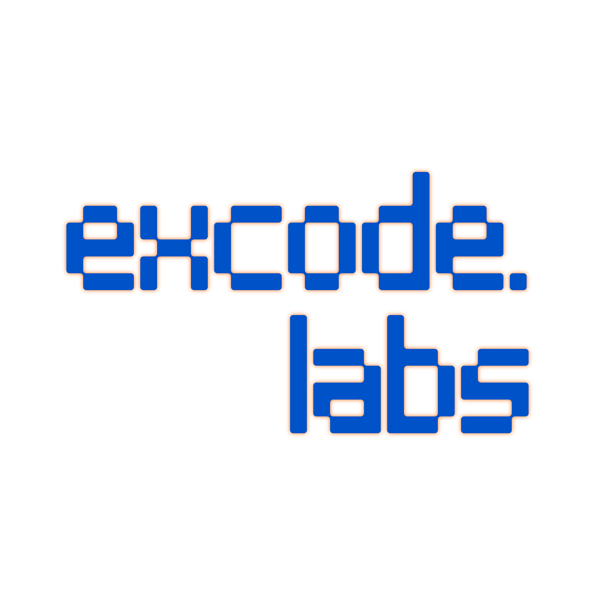

# EXCODE Labs Website



Business website built with Next.js App Router for EXCODE Labs.

## Overview

This project includes a complete multi-page marketing website with:

- Landing page with hero, services, portfolio highlights, testimonials, client carousel, and contact section
- Dedicated pages for Services, Portfolio, Careers, About, and Contact
- Reusable component system (Navbar, Footer, Hero, Section, Card, Buttons, Forms)
- Responsive layout with mobile navigation menu
- Functional API routes for contact and careers application forms

## Tech Stack

- Next.js 16 (App Router)
- React 19
- TypeScript
- Tailwind CSS v4
- ESLint + Prettier
- Jest (configured, not required for current delivery)

## Project Structure

Key folders:

- app: Route pages and API handlers
- components: Reusable UI and form components
- lib: Static site data used by pages
- public: Static assets (including logo and fonts)

## Implemented Pages

- / (Home)
- /services
- /portfolio
- /careers
- /about
- /contact

## API Routes

- POST /api/contact: Handles contact form submission validation
- POST /api/careers: Handles job application form submission validation

## Getting Started

Install dependencies:

```bash
npm install
```

Run development server:

```bash
npm run dev
```

Open http://localhost:3000 in your browser.

## Scripts

```bash
npm run dev         # Start development server
npm run build       # Create production build
npm run start       # Run production server
npm run lint        # Run ESLint checks
npm run format      # Format files with Prettier
npm run format:check
npm run test
npm run test:cov
```

## Deployment

Recommended deployment targets:

- Vercel
- Netlify

Production commands:

```bash
npm run build
npm run start
```
